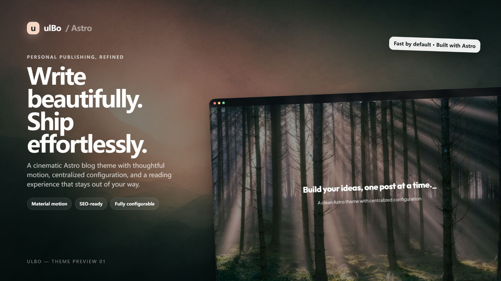
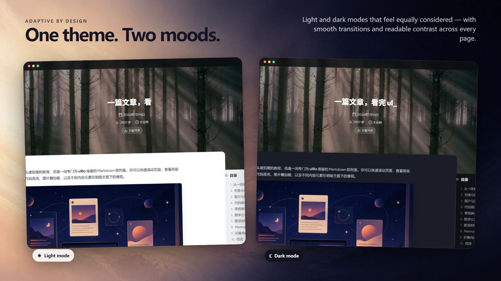

# ulBo Astro Theme

<p align="center">
  <strong>Un tema per blog personale in Astro, pensato per unire espressione visiva, lettura di contenuti lunghi e un flusso di pubblicazione completo.</strong>
</p>

<p align="center">
  <a href="./README.md">Italiano</a> ·
  <a href="./README.en.md">English</a>
</p>

<p align="center">
  <a href="https://astro.build/"></a>
  <a href="https://nodejs.org/"></a>
  <a href="./LICENSE"></a>
</p>

<p align="center">
  <a href="https://template.ulna520.top"><strong>Anteprima online</strong></a> ·
  <a href="https://blog.ulna520.top">Blog reale</a> ·
  <a href="https://astro.build/themes/details/ulbo/">Negozio temi Astro</a> ·
  <a href="https://github.com/xxy1103/ulbo_vscode">Strumento di gestione articoli per VS Code</a>
</p>



## Perché scegliere ulBo

ulBo è pensato per scrittori, sviluppatori e creatori indipendenti che vogliono mantenere un contenuto personale nel lungo periodo. Non offre solo un set di pagine per il blog: combina esperienza di lettura, organizzazione dei contenuti, ricerca, SEO, ottimizzazione delle immagini e un flusso di scrittura quotidiano in una soluzione completa.

| Area | Capacità |
| --- | --- |
| **Visuale e animazioni** | Hero immersivo, layout responsive, tema chiaro/scuro e animazioni di pagina basate su Astro View Transitions e curve Material Design 3. |
| **Lettura di contenuti lunghi** | Indice fisso, conteggio parole e tempo di lettura, copia del codice, formule KaTeX, grafici Mermaid, lightbox per le immagini ed esportazione PDF ottimizzata per la stampa. |
| **Scoperta dei contenuti** | Ricerca fuzzy con Fuse.js, scorciatoia `Cmd/Ctrl + K`, archivio articoli, filtro per tag e paginazione. |
| **Qualità di pubblicazione** | Frontmatter rigoroso, isolamento delle bozze, RSS, Sitemap, Canonical, Open Graph, Twitter Card e JSON-LD. |
| **Configurazione e migrazione** | Sito, profilo e contenuto Hero concentrati in `src/config/`; supporto Markdown / MDX e percorsi immagine in stile Hexo. |
| **Ingegneria delle prestazioni** | Lazy loading delle immagini, decodifica asincrona, KaTeX on-demand, indice di ricerca differito, strategie di prefetch e flusso di ottimizzazione WebP con anteprima. |

## Anteprima del tema

<table>
  <tr>
    <td width="50%"></td>
    <td width="50%"></td>
  </tr>
  <tr>
    <td align="center"><strong>Esperienza coerente tra tema chiaro e scuro</strong></td>
    <td align="center"><strong>Strumenti di lettura per articoli tecnici lunghi</strong></td>
  </tr>
</table>


## Avvio rapido

Clicca su **Use this template** nel repository GitHub per creare il tuo blog, poi esegui:

```bash
npm install
npm run dev
```

L'indirizzo predefinito è `http://localhost:4321`.

Requisiti di ambiente:

- Node.js 22.12.0 o superiore
- npm 9.6.5 o superiore

## Configurare il blog

Di solito è sufficiente modificare i seguenti punti:

| File | Scopo |
| --- | --- |
| `src/config/site.ts` | Indirizzo del sito, titolo, descrizione, lingua e link al repository |
| `src/config/profile.ts` | Avatar, presentazione, contatti e link social |
| `src/config/hero.ts` | Hero predefinito di Home, Archivio, Tag, About e articoli |
| `src/content/blog/` | Articoli Markdown / MDX |
| `public/image/` | Immagini di articoli e pagine |

Anche se `src/content/blog/` è vuota, le pagine principali (Home, Archivio, Tag, About) si costruiscono correttamente: puoi personalizzare la configurazione prima di iniziare a pubblicare contenuti.

## Scrivere un articolo

Crea un file `.md` o `.mdx` in `src/content/blog/`:

```md
---
title: "Il mio primo articolo"
date: "2026-08-03T10:00:00+02:00"
description: "Come usare ulBo per creare un blog personale: configurazione del tema, scrittura, anteprima locale, ottimizzazione delle immagini e deploy."
draft: false
categories:
  - "Diario"
tags:
  - "astro"
  - "blog"
---

Il testo inizia da qui.
```

Campi completi e regole di validazione in [Standard Frontmatter](./standard/frontmatter.md).

La build di produzione esclude automaticamente le bozze e copre Home, Archivio, dettaglio articolo, tag, indice di ricerca e RSS; in ambiente di sviluppo le bozze restano visibili per la revisione e la correzione.

## Consigliato: ulBo Article Manager

[ulBo Article Manager](https://github.com/xxy1103/ulbo_vscode) è uno strumento di scrittura opzionale per VS Code sviluppato per questo tema. Ti permette di fare, accanto al tuo editor Markdown:

- Creare bozze, cercare, filtrare e aprire articoli;
- Modificare visivamente titolo, data, descrizione, categoria, tag e stato di bozza;
- Generare la descrizione dell'articolo con un modello linguistico di VS Code, con fallback all'estrazione locale;
- Avviare il server di sviluppo Astro e anteprimere l'articolo corrente;
- Validare Frontmatter, tag e immagini referenziate prima della pubblicazione;
- Mettere in stage su Git con precisione articoli e immagini collegate;
- Spostare gli articoli eliminati nel cestino di sistema, conservando la possibilità di recuperarli.

Il tema si occupa di visualizzazione e build, il plugin di scrittura e gestione degli articoli. Il plugin non esegue automaticamente commit, push o deploy: la pubblicazione finale resta sotto il tuo controllo.

La versione corrente si installa dal repository del plugin come VSIX locale; i dettagli sono nel [README di ulBo Article Manager](https://github.com/xxy1103/ulbo_vscode#readme).

## SEO e prestazioni

Il codice implementa già:

- Canonical, robots, Open Graph, Twitter Card e JSON-LD;
- Dati strutturati: `WebSite` in Home, `Person` nella pagina About, `BlogPosting` negli articoli;
- RSS, Sitemap e `noindex,follow` con `rel=prev/next` per l'archivio paginato;
- Lazy loading e decodifica asincrona delle immagini Markdown;
- Preload dell'Hero degli articoli, caricamento on-demand degli stili KaTeX;
- Indice di ricerca scaricato alla prima apertura;
- Prevenzione del flash del tema chiaro/scuro al primo caricamento;
- Strumento di ottimizzazione WebP indipendente dalla build normale.

`npm run build` si occupa solo di compilare: non modifica articoli o immagini. Quando vuoi ottimizzare le immagini, prima controlla le modifiche, poi esegui esplicitamente:

```bash
npm run optimize:images:dry-run
npm run optimize:images
```

Confini di implementazione e posizione del codice più completi in [README in inglese](./README.en.md#seo-optimizations-code-aligned).

## Comandi utili

| Comando | Descrizione |
| --- | --- |
| `npm run dev` | Avvia il server di sviluppo |
| `npm run build` | Compila la versione di produzione, senza modificare articoli o immagini |
| `npm run preview` | Anteprima del risultato della build di produzione |
| `npm run check` | Controlla Astro e TypeScript |
| `npm test` | Esegue i test |
| `npm run frontmatter:check` | Verifica in sola lettura il Frontmatter degli articoli |
| `npm run frontmatter:fix` | Normalizza il Frontmatter e verifica che il corpo non sia stato modificato |
| `npm run optimize:images:dry-run` | Anteprima dei risultati dell'ottimizzazione immagini |
| `npm run optimize:images` | Genera WebP e aggiorna i riferimenti negli articoli |

## Deploy

Il progetto genera file statici: può essere pubblicato su Cloudflare Workers / Pages, Vercel, Netlify o GitHub Pages.

Il repository include già la configurazione Cloudflare Workers Static Assets:

```bash
npm run build
npm run deploy
```

Per altre piattaforme: comando di build `npm run build`, directory di output `dist`.

## Struttura del progetto

```text
src/
├─ components/       Componenti delle pagine
├─ config/           Configurazione di sito, profilo e Hero
├─ content/blog/     Articoli Markdown / MDX
├─ layouts/          Layout generali e layout degli articoli
├─ lib/              Logica di contenuti, ricerca e profilo
├─ pages/            Route: Home, Archivio, Tag, About, RSS, ecc.
├─ plugins/          Plugin di elaborazione Markdown / HTML
└─ scripts/          Ricerca, indice, Mermaid, lightbox e interazioni di pagina
```

Relazioni tra i moduli frontend in [Mappa dell'architettura](./docs/frontend-architecture-map.md).

## Progetti correlati

- [ulBo Article Manager](https://github.com/xxy1103/ulbo_vscode): strumento di gestione articoli per VS Code.
- [xxy1103.github.io](https://github.com/xxy1103/xxy1103.github.io): blog personale reale creato con ulBo.

## Contribuire

Issue e Pull Request sono benvenuti. Prima di iniziare leggi [Guida ai contributi](./CONTRIBUTING.md), [Codice di condotta](./CODE_OF_CONDUCT.md) e [Politica di sicurezza](./SECURITY.md).

## Licenza

[MIT](./LICENSE)
